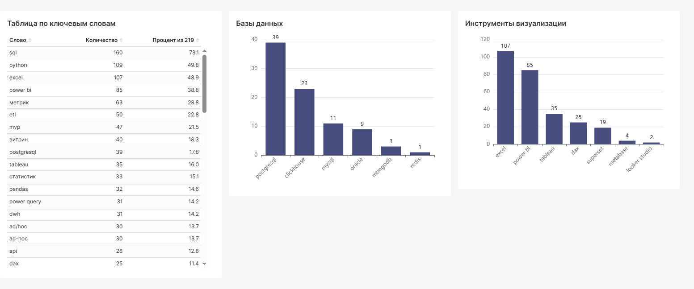

## API сайта hh.ru ##

Задача: используя API сайта, получить список интересующих вакансий, вывести в читаемом формате, построить дашборд. 

Задача реализована с помощью 4 скриптов, основной из них main.py

**Python**

 
Код main.py

'''
import pandas as pd
import requests
from time import sleep
from datetime import datetime as dt

import database
import html

def get_full_description(vacancy_id):
    """Получает полную информацию о вакансии по ID
       Например: ID = 129649979, тогда url: https://api.hh.ru/vacancies/129984355
    """
    url = f"https://api.hh.ru/vacancies/{vacancy_id}"
    response = requests.get(url)
    
    if response.status_code == 200:
        return response.json()
    else:
        print(f"Ошибка при запросе вакансии {vacancy_id}: {response.status_code}")
        return None

"""
Получить список вакансий по
за период 3 дней и на удаленную работу 
 1. профессиональные роли: 156, 165, 160 или python или робототехник в названии вакансии , без опыта
 2. профессиональные роли: 156 или робототехник в названии вакансии и с опытом 1-3 года
"""
url = 'https://api.hh.ru/vacancies'
lst_experim = ['noExperience', 'between1And3']
params = {
    'per_page': 100,
    'period': 3,
    'schedule': 'remote',
    'search_field': 'name'
}
detailed_vacancies = [] # вакансии с полным описанием

for exper in lst_experim:
    params['experience'] = exper
    if exper == 'noExperience':
        params['text'] = 'professional_role:(156 OR 165 OR 160) OR ( (NAME:python OR NAME:робототехник) AND NOT (NAME:преподаватель OR NAME:учитель OR NAME:педагог) )'
    else:
        params['text'] = 'professional_role:156 OR (NAME:робототехник AND NOT (NAME:преподаватель OR NAME:учитель OR NAME:педагог))'
    
    for page in range(20):  # Максимум 20 страниц на выдачу
        params['page'] = page
        sleep(0.5)
        print(f"Смотрим страницу №{page}")
        response = requests.get('https://api.hh.ru/vacancies', params=params)

        # Если все страницы уже просмотрели, то вернёт не 200 или пустой список
        if response.status_code != 200 or not response.json()['items']:
            print("ПРОСМОТРЕЛИ ВСЕ СТРАНИЦЫ")
            break

        data = response.json()
    
        all_vacancies = data['items']
        #pprint(all_vacancies)
    
        # Получим полное описание вакансии
        for i, vacancy in enumerate(all_vacancies):
            vacancy_id = vacancy.get('id')
        
            # Задержка, чтобы не превысить лимит запросов
            sleep(0.2)  # 5 запросов в секунду - в пределах лимита
            print(f"Номер вакансии {i}")
            details = get_full_description(vacancy_id)
    
            if details:
                # Объединяем vacancy с полным описанием full_description и скиллами key_skills из details
                detailed_vacancy = {
                    'id': vacancy_id,
                    'name': vacancy.get('name'),
                    'url': vacancy.get('alternate_url'),
                    'employer': vacancy.get('employer', {}).get('name'),
                    'area': vacancy.get('area', {}).get('name'),
                    'salary_from': vacancy.get('salary', {}).get('from') if vacancy.get('salary') else None,
                    'salary_to': vacancy.get('salary', {}).get('to') if vacancy.get('salary') else None,
                    'salary_currency': vacancy.get('salary', {}).get('currency') if vacancy.get('salary') else None,
                    'professional_roles': vacancy.get('professional_roles'),
                    'published_at': vacancy.get('published_at')[:10],
                    'experience': vacancy.get('experience', {}).get('name'),
                    'schedule': vacancy.get('schedule', {}).get('name'),
                    'employment': vacancy.get('employment', {}).get('name'),
                    'full_description': details.get('description'),  # Полное описание вакансии
                    'key_skills': [skill.get('name') for skill in details.get('key_skills', [])]
                }
        
            detailed_vacancies.append(detailed_vacancy)
    
      
# Создаем DataFrame
df = pd.DataFrame(detailed_vacancies).sort_values(by=['experience', 'published_at'], ascending=[True, False])

# Список ключевых навыков:
key_skills = ['a/b-тест', 'ad-hoc', 'ad/hoc', 'agile', 'airflow', 'ansible', 'api', 'bash', 'big data', 'ci/cd', 'clickhouse', 'c++', 'c#', 'data-driven', 'datalens', 'dax', 'dbt', 'django', 'docker', 'dwh', 'eda', 'etl', 'excel', 'git', 'grafana', 'greenplum', 'hadoop', 'java', 'jenkins', 'kafka', 'kubernetes', 'looker studio', 'mathplotlib', 'metabase', 'mongodb', 'mvp', 'mysql', 'n8n', 'numpy', 'oracle', 'pandas', 'postgresql', 'power bi', 'power query', 'power pivot', 'prometheus', 'python', 'pytorch', 'rabbitmq', 'redis', 'seaborn', 'sklearn', 'spark', 'sql', 'sqlalchemy', 'superset', 'tableau', 'terraform', 'витрин', 'воронка', 'пайплайн', 'статистик', 'метрик']
# Создадим столбец с скиллами из key_skills, присутствующие в столбцах 'full_description' и 'key_skills'
df['all_skills'] = df['full_description'].apply(lambda description: [skill for skill in key_skills if skill in description.lower()])
df['all_skills'] = df.apply( lambda row: list(set(row['all_skills'] + [skill.lower() for skill in row['key_skills']])), axis=1 )
print(df.shape)

#Записываем в postgresql
database.write_db(df)

#Записываем в веб-страницу
html.write_html(df)
'''

Функция get_full_description() нужна чтобы получить полное описание вакансии. 

Отправляем запрос на API с нужными мне параметрами, в первом вложенном цикле обходим все страницы, во втором вложенном цикле применяем функцию get_full_description.

В результате всех итераций сформировали словарь  detailed_vacancies. Из него создаём датафрейм. 

У меня была идея определить чаще всего встречаемый набор знаний у дата аналитика. Поэтому в датафрейме создал еще один столбец из скиллов, встрещающихся в полном описании ('full_description') и ключевых скиллах ('key_skills'). Чтобы потом через SQL сгруппировать по этому столбцу и вытащить наиболее часто встречаемое значение.

Функция write_db(), разместил её в другой модуль. Из названия понятно, что её назначение записать датафрейм в базу данных.

Функция write_html размещена в модуле html. Служит для записи датафрейма в веб-страницу. Сначала я хотел записать в csv  файл, но  его неудобно читать. Потом записывал в xlsx, уже лучше, но подумал, что раз текст описания содержит html теги, то удобнее всего изучать вакансии в веб-формате.

**Скрипт skills.ru**

 
Код skills.py

'''
import pandas as pd
import requests
from time import sleep
from datetime import date

# Получить сколько вакансий по слову есть с фильтром 'professional_roles' = 156 и опыт=1-3 года
url = 'https://api.hh.ru/vacancies'

params = {
    'per_page': 100,
    'professional_role': 156,
    'experience': 'between1And3',
    'period': 10,
    'search_field': 'description'
}

key_skills = ['a/b-тест', 'ad-hoc', 'ad/hoc', 'agile', 'airflow', 'ansible', 'api', 'bash', 'big data', 'ci/cd', 'clickhouse', 'c++', 'c#', 'data-driven', 'datalens', 'dax', 'dbt', 'django', 'docker', 'dwh', 'eda', 'etl', 'excel', 'git', 'grafana', 'greenplum', 'hadoop', 'java', 'jenkins', 'kafka', 'kubernetes', 'looker studio', 'mathplotlib', 'metabase', 'mongodb', 'mvp', 'mysql', 'n8n', 'numpy', 'oracle', 'pandas', 'postgresql', 'power bi', 'power query', 'power pivot', 'prometheus', 'python', 'pytorch', 'rabbitmq', 'redis', 'seaborn', 'sklearn', 'spark', 'sql', 'sqlalchemy', 'superset', 'tableau', 'terraform', 'витрин', 'воронка', 'пайплайн', 'статистик', 'метрик']
statistik = []
total = requests.get('https://api.hh.ru/vacancies?professional_role=156&experience=between1And3&period=10').json()['found']

for word in key_skills:
    print(word)
    count = 0
    params['text'] = word
    for page in range(20):
        params['page'] = page
        sleep(0.6)
        response = requests.get('https://api.hh.ru/vacancies', params=params)
        if response.status_code != 200 or not response.json()['items']:
            break
        data = response.json()
        count += len(data['items'])
    statistik.append([word, count, round(count*100/total, 1)])

df = pd.DataFrame(statistik, columns=['Слово', 'Количество', f'Процент из {total}'])
df = df.sort_values(by='Количество', ascending=False)
df.to_csv(f'key_words_{date.today().strftime("%d.%m.%Y")}.csv', index=False)
'''

Этот скрипт в отличии от файлов database.py и html.py выполняется отдельно от main.py, командой: python3 skills.py (в Linux).
Нужен для исследования по востребованности знаний для аналитика данных. Знания собрал в список key_skills. В результате выполнения скрипта получаю файл key_words_data.csv . В принципе его достаточно, чтобы сделать определённые выводы. Но решил дополнительно сделать из него дашборд.

**Создание дашборда**

Файл key_words .csv поместил в базу данных ClickHouse. Дашборд сделал в Superset.

